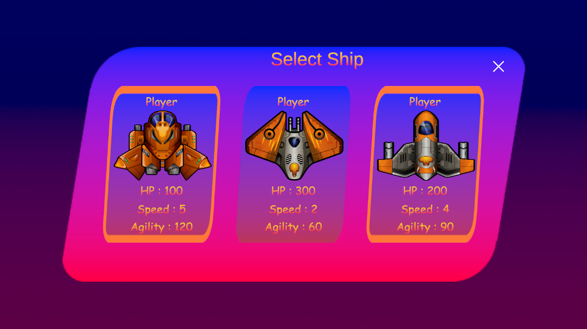
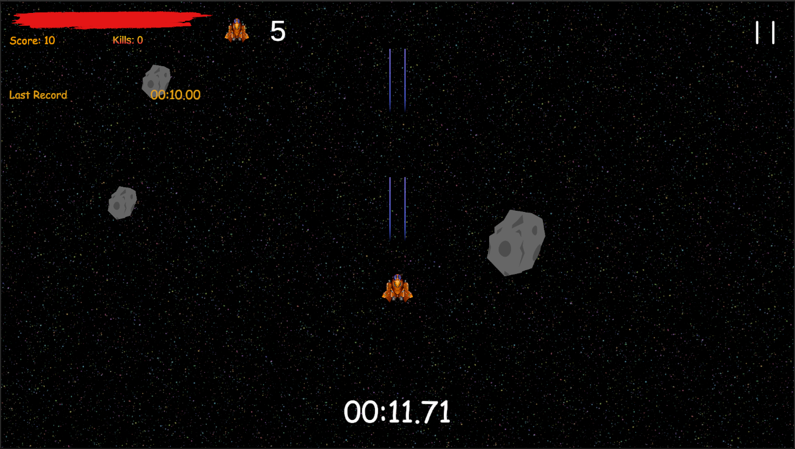
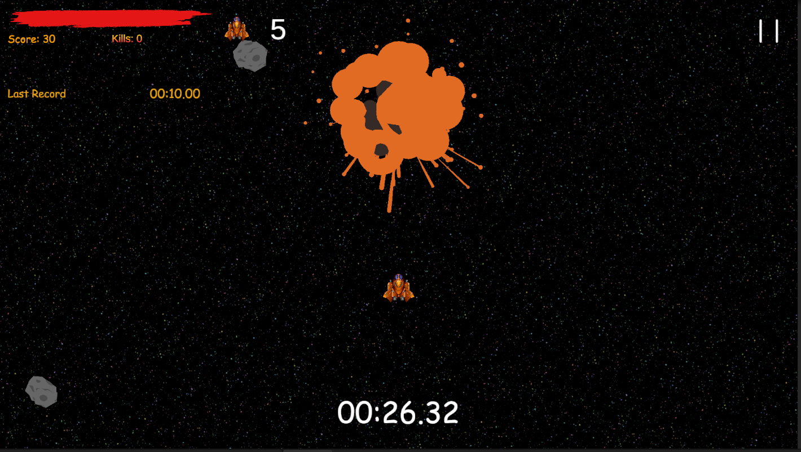

# Space Shooter Prototype

Прототип классического аркадного шутера с упором на разнообразную систему вооружения, систему улучшений (Power-ups) и различные паттерны поведения ИИ-противников.

> **⚠️ Примечание:** Проект находится в стадии активной технической переработки. Все описанные ниже механики полностью реализованы программно, однако уровни на данный момент представляют собой тестовые площадки для демонстрации систем, а не финальный левел-дизайн.

---

##  Ключевые системы и механики

### Система выбора кораблей
В главном меню реализован выбор из 3 типов космических судов, отличающихся балансом характеристик:
* **Прочность (HP)**
* **Скорость (Speed)**
* **Маневренность (Agility)**

### Боевая система
Реализована двухфазная модель стрельбы:
1. **Основное оружие (Space)**: Бесконечные заряды, ограниченные самовосстанавливающейся шкалой энергии.
2. **Вторичное оружие (X)**: Ограниченный боезапас, требует подбора бонусов на уровне. Включает:
   * **Обычные ракеты** — прямой урон.
   * **Самонаводящиеся ракеты** — поиск ближайшей цели.
   * **Тяжелые ракеты** — мощный взрыв с уроном по площади (AoE).

<table>
  <tr>
    <td width="50%">
      
    </td>
    <td width="50%">
      
    </td>
  </tr>
</table>

### Power-ups и бонусы
Система подбираемых объектов позволяет динамически менять состояние игрока:
*  **Энергия/Боезапас**: Восполнение ресурсов пушек.
*  **Неуязвимость**: Временный щит, блокирующий входящий урон.
*  **Суперскорость**: Кратковременный прирост мобильности.
*  **Смена вооружения**: Замена текущего типа вторичных ракет на новый при подборе соответствующего бонуса.

### Искусственный интеллект (Enemy AI)
В проекте реализовано два типа поведения противников:
* **Свободное патрулирование**: Случайное перемещение в заданном радиусе. При обнаружении игрока в зоне видимости — переход в режим агрессии и атаки.
* **Маршрутное патрулирование**: Движение по строго заданным точкам (Waypoints). Противник атакует игрока только в том случае, если тот пересекает границы патрулируемого маршрута.

---

##  Условия победы
Для прохождения тестовых сценариев необходимо:
1. Набрать заданное количество очков.
2. Удерживать позицию в течение установленного времени.

---

##  Технологии
* **Движок**: Unity
* **Язык**: C# 

##  Управление
* **W, A, S, D** — Перемещение корабля.
* **Space** — Основная стрельба (энергия).
* **X** — Специальное оружие (боезапас).
